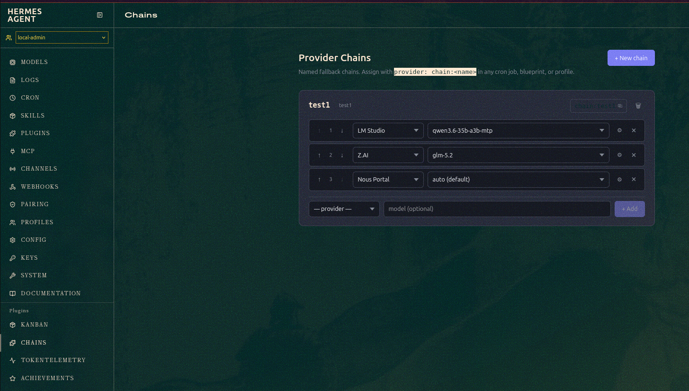

# hermes-provider-chains


A [Hermes](https://nousresearch.com/hermes) plugin that adds named provider fallback chains.

Define an ordered list of providers once, assign the chain by name anywhere Hermes accepts a model — cron jobs, blueprints, profiles, subagents. When the first provider fails (rate limit, outage, timeout), Hermes automatically tries the next one in the chain.




## What it adds

- **Chains tab** in the Hermes dashboard — create, edit, and reorder chains via a UI
- **`chain:<name>` syntax** — use a chain exactly like a provider name anywhere in Hermes config
- **Live updates** — edit chains in the dashboard; changes take effect on the next LLM call, no restart needed
- **Model picker integration** — chains appear automatically in the Hermes model picker after creation (see [note below](#model-picker-integration))

## Install

Copy (or symlink) this folder into your Hermes user plugins directory:

```bash
# Option A: copy
cp -r hermes-provider-chains ~/.hermes/plugins/provider-chains

# Option B: symlink (edits to the repo reflect immediately)
ln -s /path/to/hermes-provider-chains ~/.hermes/plugins/provider-chains
```

Then enable the plugin in your profile's `config.yaml`:

```yaml
plugins:
  enabled:
    - provider-chains
```

Restart the Hermes gateway to load the plugin:

```bash
docker restart hermes
# or: hermes --reload (if running natively)
```

## Usage

### Define a chain in the dashboard

Open the Hermes dashboard → **Chains** tab → **New chain**.

Add provider entries in order. When one fails, Hermes tries the next.

Each chain card shows a copyable `chain:<name>` reference you can paste directly into cron jobs, blueprints, or profiles.

### Per-entry options (⚙ button on each row)

| Option | Description |
|---|---|
| Timeout | Override the default request timeout for this provider (seconds) |
| Max tokens | Cap output tokens for this provider |
| Temperature | Sampling temperature (0.0–2.0) |
| Retry count | Retry this provider N times before advancing to the next entry |
| Thinking | Enable or disable extended thinking — `inherit` (default), `enabled`, `disabled`. Only effective on models that support extended thinking (e.g. Claude 3.5+) |
| Thinking effort | Budget when thinking is enabled — `low`, `medium`, or `high`. `inherit` uses the provider default |
| Base URL | Override the provider's base URL |
| API key | Override the provider's API key (use Infisical for production secrets) |

### Or define chains directly in chains.json

```json
{
  "version": 1,
  "chains": {
    "local-first": {
      "label": "Local first",
      "entries": [
        {
          "provider": "lmstudio",
          "model": "qwen3.6-35b-a3b-mtp",
          "timeout": 1800,
          "max_tokens": null,
          "temperature": null,
          "retry_count": 1,
          "base_url": null,
          "api_key": null,
          "thinking": null,
          "thinking_effort": null
        },
        {
          "provider": "freellmapi",
          "model": "auto",
          "timeout": 60,
          "max_tokens": 4096,
          "temperature": 0.7,
          "retry_count": 0,
          "base_url": null,
          "api_key": null,
          "thinking": null,
          "thinking_effort": null
        }
      ]
    },
    "claude-thinking": {
      "label": "Claude with thinking",
      "entries": [
        {
          "provider": "anthropic",
          "model": "claude-opus-4-8",
          "timeout": 600,
          "max_tokens": 16000,
          "temperature": 1.0,
          "retry_count": 1,
          "base_url": null,
          "api_key": null,
          "thinking": true,
          "thinking_effort": "high"
        },
        {
          "provider": "openrouter",
          "model": "anthropic/claude-opus-4-8",
          "timeout": 600,
          "max_tokens": 16000,
          "temperature": 1.0,
          "retry_count": 0,
          "base_url": null,
          "api_key": null,
          "thinking": true,
          "thinking_effort": "medium"
        }
      ]
    }
  }
}
```

All per-entry fields are optional — `null` means "use the provider/profile default".

Location: `$HERMES_HOME/chains.json` (default: `~/.hermes/chains.json`)

> **Note:** In multi-profile setups the file lives at the gateway-level HERMES_HOME, not per-profile.
> All profiles share the same chains.json.

### Assign to a cron job

```json
{
  "provider": "chain:local-first",
  "schedule": "0 * * * *",
  "prompt": "..."
}
```

### Assign to a blueprint

```yaml
metadata:
  hermes:
    blueprint:
      provider: chain:fast-first
      schedule: "0 9 * * *"
```

### Assign as profile fallback

```yaml
# config.yaml
fallback_model:
  provider: chain:local-first
  model: auto
```

## Multi-profile (per-profile HERMES_HOME)

If your Hermes uses per-profile `HERMES_HOME` paths, install the plugin in each profile that needs it:

```bash
# One shared copy, symlinked per profile
mkdir -p /data/hermes/hermes-profiles/plugins/provider-chains
cp -r . /data/hermes/hermes-profiles/plugins/provider-chains/

for profile in local-admin planner qa-tester coder; do
  ln -s ../../../plugins/provider-chains \
    /data/hermes/hermes-profiles/profiles/$profile/plugins/provider-chains
done
```

The plugin stores chains.json at the base `HERMES_HOME` (one level above `profiles/`), shared across all profiles.

## Model picker integration

When you create or delete a chain via the dashboard, the plugin automatically writes a virtual provider entry (`chain:<name>`) into each enabled profile's `config.yaml`. This makes chains selectable from the **Hermes model picker** (`/models?profile=...`) immediately — no restart required.

The virtual provider entry looks like this (added and removed automatically):

```yaml
providers:
  'chain:local-first':
    base_url: http://provider-chains-virtual/v1
    api_key: provider-chains-virtual
    _virtual: provider-chains
```

The `base_url` is a placeholder — the Python resolver intercepts the request before any HTTP call is made.

### Limitations of the current approach

The model picker cannot list the individual providers *within* a chain (it shows `chain:local-first` as a provider with no sub-models, not a breakdown of the chain entries). This is a trade-off of not modifying Hermes core.

### Option B — proper plugin hook (no Hermes core change needed once the hook exists)

The plugin is already written for Option B. `__init__.py` exposes a module-level `build_models_payload()` function and `register()` tries to hook into Hermes at startup:

```python
# Already in __init__.py — active automatically when Hermes supports it
def build_models_payload(profile=None):
    chains = load_chains()
    return [{"slug": "chain", "name": "Provider Chains", "models": list(chains.keys())}]
```

`register()` probes for the hook and uses it if available; otherwise it falls back to Option A silently. No config change needed — it's automatic.

**What needs to change in Hermes core** (`hermes_cli/inventory.py`):

```python
# Proposed addition to build_models_payload() in inventory.py
for plugin in ctx.plugins:
    if hasattr(plugin, "build_models_payload"):
        try:
            extra = plugin.build_models_payload(profile=profile)
            payload["providers"].extend(extra)
        except Exception:
            pass
```

And in `register_plugin()` or equivalent, expose the hook on `ctx`:

```python
ctx.register_models_provider = lambda fn: _models_providers.append(fn)
```

Once Hermes adds this hook, Option B activates automatically — chains will appear under a single **"Provider Chains"** group in the picker with all chain names listed as models, and the config.yaml sync (Option A) stops running.

If you want this in Hermes, open an issue or PR requesting a `build_models_payload` plugin hook in `inventory.py`.

## Requirements

- Hermes v17+ (plugin API v1.1.0+)
- Python 3.10+
- FastAPI (included with Hermes)
- `ruamel.yaml` (included with Hermes; only needed for model picker sync)

## Authors

- **[risers-chevron](https://github.com/risers-chevron)**

Built with [Claude Code](https://claude.ai/code) by Anthropic.

## License

MIT
